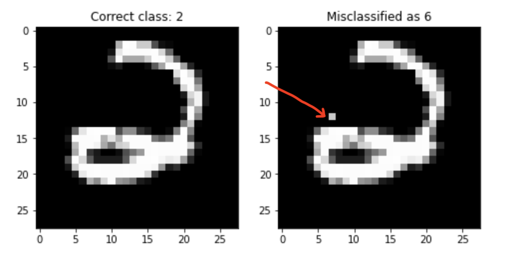
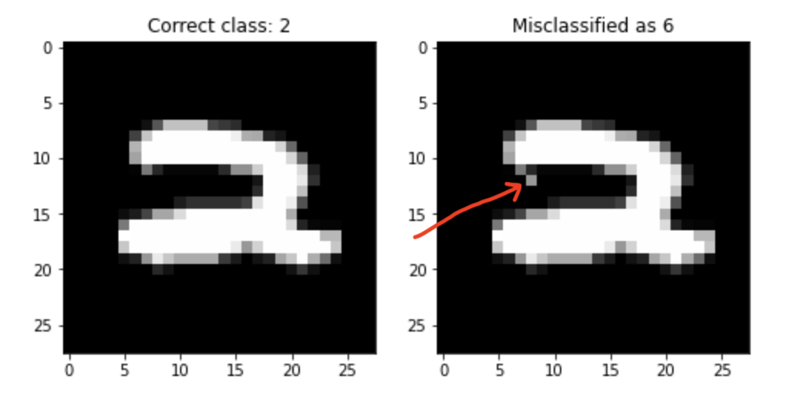
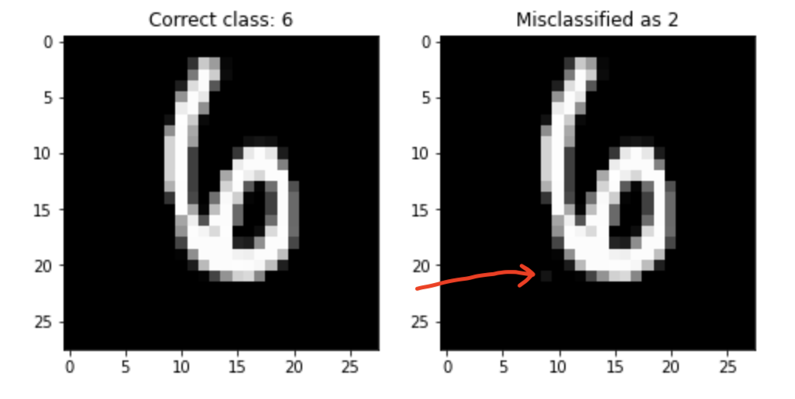

# Evasion and Hardening of Tree Ensemble Classifiers
> This project tries to implement the idea mentioned in the <a href='https://arxiv.org/pdf/1509.07892.pdf'>paper</a> which is to find finding for a given instance `x` the “nearest” instance `x_prime` such that the classifier predictions of `x` and `x_prime` are different.


Currently we have looked at Random Forest Classifiers ( scikit-learn ) implementation but the idea can easily be extended to GBDT. Currently the package implements the `Approximate Evasion` method implemented in the paper. For experimental evaluation we look at `MNIST` digit classification dataset with only two categories `2` and `6`. The paper also chooses this dataset because it is well studied datasets, one-to-one mapping between pixels and features and features can vary independently of each other. We can pictorially represent evading instances, and this helps understanding the models’ robustness or lack of.

## How to use

```
from sklearn.ensemble import RandomForestClassifier

from tree_evasion.core import *
from tree_evasion.tree import *
from tree_evasion.symbolic_prediction import *

Xtr, Xva, Xte, ytr, yva, yte = get_mnist_dataset(SEED)

clf = RandomForestClassifier(n_estimators=5, max_depth=4, random_state=SEED, n_jobs=-1)
clf.fit(Xtr, ytr)

# performance on the holdout set
print(clf.score(Xva, yva))

pairs = CoordinateDescent.get_pairs(clf, Xte)
```

In this example we want to change only one pixel for an instance and see if the classifier prediction changes or not. [notebook](02_SymbolicInstance.ipynb)

## Results







## Applications

As the paper mentions, we expect a high performance learning algorithm to generalize well and be hard to evade: only a “large enough” perturbation δ should be able to alter its decision. The existence of small-δ evading instances shows a defect in the generalization ability of the model, and hints at improper model class and/or insufficient regularization. 

Since machine learning systems are being deployed in many security-oriented applications. In these applications attacker has a large incentive to find evading instances and fool the system. 

## Next Steps

- [ ] We have only tackled the `Approximate Evasion`, paper mentions another algorithm which uses Mixed Integer Linear Programming.
- [ ] After finding good evading instances, author suggests to include them in the training set and retrain. This process is called `Adversarial Boosting`.
